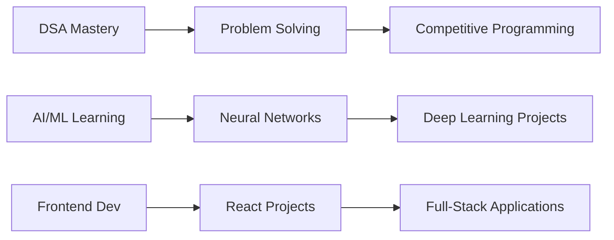

#  Hey there, I'm Aditya!

  

  
  
  
  
  

---

##  About Me

- 🔭 Currently mastering **Data Structures & Algorithms**
- 🌱 Deep diving into **AI/ML** and building intelligent systems
- 💻 Crafting beautiful experiences with **Frontend Development**
- 🎯 2025 Goals: Contribute to Open Source & Build impactful projects
- ⚡ Fun fact: I debug with `print()` statements and I'm not ashamed
- 🎨 Love making things that are both functional AND beautiful

 

## 🛠️ Tech Arsenal

### 💪 Core Languages

### 🧠 AI/ML Stack

### 🎨 Frontend Magic

### 🔧 Tools & Technologies

---

## 📊 GitHub Analytics

  
  

  

---

## 🏆 GitHub Trophies

  

---

## 📈 Contribution Graph

  

---

## 🎯 Current Focus

  

---

## 🚀 Featured Projects

  

---

## 💬 Random Dev Quote

  

---

## 🤝 Let's Connect!

  

---

  
  

  <i>Let's build something amazing together!</i>

