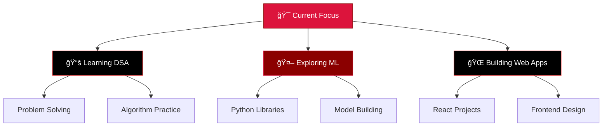

#

  

  
  

  
  
  
  
  

---

##  About Me

- 🔭 Currently mastering **Data Structures & Algorithms**
- 🌱 Deep diving into **Machine Learning** and **AI/ML** technologies
- 💻 Building web applications with **React** and modern frontend technologies
- 🎯 **2025 Goals**: Contribute to Open Source projects & Build impactful applications
- ⚡ **Fun fact**: I debug with `console.log()` and `print()` statements and I'm not ashamed
- 🌍 **Location**: Muradnagar, Uttar Pradesh, India
- 💬 **Ask me about**: Python, C++, DSA, Machine Learning, or Frontend Development

 

## 💻 Technologies I Work With

**Languages & Frameworks I'm comfortable with:**

**Tools & Technologies I use:**

**Learning & Exploring:**

---

## 📊 Analytics

  
  

  
  

  

## 📈 Contribution Activity

  

---

## 🚀 Projects & Repositories

  

---

## 🎯 What I'm Working On

---

## 📚 Current Focus

| Area | Technology/Topic | Status |
|------|------------------|--------|
| 🔴 **Programming** | Data Structures & Algorithms | 🔄 Active |
| ⚫ **AI/ML** | Machine Learning Fundamentals | 🔄 Learning |
| 🔴 **Frontend** | React & Modern Web Dev | 🔄 Building |
| ⚫ **Backend** | API Development | 📋 Exploring |

## 📫 Let's Connect & Collaborate!

  

### 🤝 Open for Collaboration
- 💼 **Learning Opportunities** in Software Development and AI/ML
- 🚀 **Open Source Projects** - Always interested in contributing
- 📝 **Knowledge Sharing** through code and documentation
- 🎤 **Community Participation** in tech discussions and events

---

## 💬 Random Dev Wisdom

  

  
  
  ### 🚀 *"Code is like humor. When you have to explain it, it's bad."* – Cory House
  
  

---

  <i>⭐ From [CODED-DIGNITY](https://github.com/CODED-DIGNITY) with ❤️</i>

