#  Hey there, I'm Aditya!

<div align="center">
  
</div>

<div align="center">
  
  [](https://github.com/CODED-DIGNITY)
  [](https://github.com/CODED-DIGNITY?tab=followers)
  [](https://github.com/CODED-DIGNITY?tab=repositories)
  
</div>

---

##  About Me


- 🔭 Currently mastering **Data Structures & Algorithms**
- 🌱 Deep diving into **Machine Learning** and **AI/ML** technologies
- 💻 Building web applications with **React** and modern frontend technologies
- 🎯 **2025 Goals**: Contribute to Open Source projects & Build impactful applications
- ⚡ **Fun fact**: I debug with `console.log()` and `print()` statements and I'm not ashamed
- 🌍 **Location**: Muradnagar, Uttar Pradesh, India
- 💬 **Ask me about**: Python, C++, DSA, Machine Learning, or Frontend Development

<br clear="right"/>

## 💻 Technologies I Work With

<div align="center">

**Languages & Frameworks I'm comfortable with:**


**Tools & Technologies I use:**


**Learning & Exploring:**


</div>

---

## 📊 GitHub Analytics

<div align="center">
  
  
</div>

<div align="center">
  
</div>

---

## 🏆 GitHub Achievements

<div align="center">
  
</div>

---

## 📈 Contribution Activity

<div align="center">
  
</div>

---

## 🚀 Projects & Repositories

<div align="center">
  
[](https://github.com/CODED-DIGNITY/machine-learning-projects)
[](https://github.com/CODED-DIGNITY/dsa-solutions)

</div>

---

## 🎯 What I'm Working On

```mermaid
graph TB
    A[🎯 Current Focus] --> B[📚 DSA Mastery]
    A --> C[🤖 ML Projects]
    A --> D[🌐 Full-Stack Apps]
    
    B --> E[LeetCode Daily]
    B --> F[System Design]
    
    C --> G[Computer Vision]
    C --> H[Deep Learning]
    
    D --> I[React Projects]
    D --> J[API Development]
    
    style A fill:#DC143C,stroke:#8B0000,color:#fff
    style B fill:#000000,stroke:#FF4444,color:#fff
    style C fill:#8B0000,stroke:#DC143C,color:#fff
    style D fill:#000000,stroke:#FF4444,color:#fff
```



---

## 📚 Current Focus

<div align="center">

| Area | Technology/Topic | Status |
|------|------------------|--------|
| 🔴 **Programming** | Data Structures & Algorithms | 🔄 Active |
| ⚫ **AI/ML** | Machine Learning Fundamentals | 🔄 Learning |
| 🔴 **Frontend** | React & Modern Web Dev | 🔄 Building |
| ⚫ **Backend** | API Development | 📋 Exploring |

</div>

---

## 🎨 Skills Proficiency

<div align="center">

```python
skills = {
    "Python": "🔴🔴🔴🔴🔴🔴🔴🔴🔴⚫ 90%",
    "C++": "🔴🔴🔴🔴🔴🔴🔴🔴⚫⚫ 80%", 
    "Data Structures": "🔴🔴🔴🔴🔴🔴🔴🔴⚫⚫ 85%",
    "Machine Learning": "🔴🔴🔴🔴🔴🔴🔴⚫⚫⚫ 75%",
    "Frontend (React)": "🔴🔴🔴🔴🔴🔴🔴⚫⚫⚫ 70%",
    "Problem Solving": "🔴🔴🔴🔴🔴🔴🔴🔴⚫⚫ 85%",
    "Git & Version Control": "🔴🔴🔴🔴🔴🔴🔴🔴⚫⚫ 80%"
}
```

</div>

---

## 📫 Let's Connect & Collaborate!

<div align="center">
  
[](https://linkedin.com/in/aditya-sharma-28a017351/)
[](https://twitter.com/CODED_DIGNITY)
[](mailto:ads.as3030@gmail.com)
[](https://leetcode.com/u/lpMDB6RtaU/)
[](https://yourportfolio.com)

</div>

### 🤝 Open to Opportunities
- 💼 **Internships** in Software Development, AI/ML, or Data Science
- 🚀 **Collaboration** on interesting open-source projects
- 📝 **Technical Writing** and creating educational content
- 🎤 **Speaking** at tech events and workshops

---

## 💬 Random Dev Wisdom

<div align="center">
  
</div>

---

## 📊 Weekly Development Breakdown

<!--START_SECTION:waka-->
```text
Python       8 hrs 45 mins   🔴🔴🔴🔴🔴🔴🔴🔴🔴⚫⚫⚫   45.2%
C++          4 hrs 12 mins   🔴🔴🔴🔴🔴🔴⚫⚫⚫⚫⚫⚫   21.7%
JavaScript   3 hrs 8 mins    🔴🔴🔴🔴⚫⚫⚫⚫⚫⚫⚫⚫   16.2%
HTML/CSS     2 hrs 1 min     🔴🔴🔴⚫⚫⚫⚫⚫⚫⚫⚫⚫   10.4%
Others       1 hr 15 mins    🔴⚫⚫⚫⚫⚫⚫⚫⚫⚫⚫⚫    6.5%
```
<!--END_SECTION:waka-->

---

<div align="center">
  
  
  ### 🚀 *"Code is like humor. When you have to explain it, it's bad."* – Cory House
  
  
</div>

---

<div align="center">
  <i>⭐ From [CODED-DIGNITY](https://github.com/CODED-DIGNITY) with ❤️</i>
</div>
