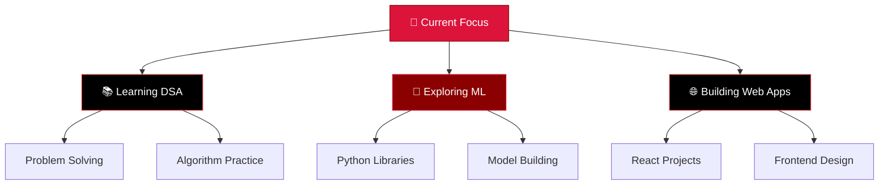

#  Hey there, I'm Aditya!

  

 

  
  
  
  
  

  

##  About Me

- 🔭 Currently mastering **Data Structures & Algorithms**
- 🌱 Deep diving into **Machine Learning** and **AI/ML** technologies  
- 💻 Building web applications with **React** and modern frontend technologies
- 🎯 **2025 Goals**: Contribute to Open Source projects & Build impactful applications
- ⚡ **Fun fact**: I debug with `console.log()` and `print()` statements and I'm not ashamed
- 🌍 **Location**: Muradnagar, Uttar Pradesh, India
- 💬 **Ask me about**: Python, C++, DSA, Machine Learning, or Frontend Development

 

## 💻 Technologies I Work With

<h3 style="color: #E74C3C; margin-bottom: 16px; font-weight: 600;">Languages & Frameworks I'm comfortable with</h3>

<h3 style="color: #E74C3C; margin-bottom: 16px; font-weight: 600;">Tools & Technologies I use</h3>

<h3 style="color: #E74C3C; margin-bottom: 16px; font-weight: 600;">Learning & Exploring</h3>

 

## 📊 GitHub Analytics

  
  

  

## 📈 Contribution Activity

  

 

## 🚀 Projects & Repositories

  

 

## 🎯 What I'm Working On

```mermaid
graph TB
    A[🎯 Current Focus] --> B[📚 Learning DSA]
    A --> C[🤖 Exploring ML]
    A --> D[🌐 Building Web Apps]
    
    B --> E[Problem Solving]
    B --> F[Algorithm Practice]
    
    C --> G[Python Libraries]
    C --> H[Model Building]
    
    D --> I[React Projects]
    D --> J[Frontend Design]
    
    style A fill:#DC143C,stroke:#8B0000,color:#fff
    style B fill:#000000,stroke:#FF4444,color:#fff
    style C fill:#8B0000,stroke:#DC143C,color:#fff
    style D fill:#000000,stroke:#FF4444,color:#fff
```

---

## 📚 Current Focus

| Area | Technology/Topic | Status |
|------|------------------|--------|
| 🔴 **Programming** | Data Structures & Algorithms | 🔄 Active |
| ⚫ **AI/ML** | Machine Learning Fundamentals | 🔄 Learning |
| 🔴 **Frontend** | React & Modern Web Dev | 🔄 Building |
| ⚫ **Backend** | API Development | 📋 Exploring |

## 📫 Let's Connect & Collaborate!

  

### 🤝 Open for Collaboration
- 💼 **Learning Opportunities** in Software Development and AI/ML
- 🚀 **Open Source Projects** - Always interested in contributing
- 📝 **Knowledge Sharing** through code and documentation
- 🎤 **Community Participation** in tech discussions and events

---

## 💬 Random Dev Wisdom

  

  

    
    <h2 style="color: #E74C3C; margin-bottom: 16px; font-size: 28px; font-weight: 600;">Thanks for stopping by!</h2>
    
    

      

        "The best way to learn is to build something awesome"
      

    

    
    

      <i style="color: #95a5a6; font-size: 16px;">⭐ From <a href="https://github.com/CODED-DIGNITY" style="color: #E74C3C; text-decoration: none; font-weight: 600;">CODED-DIGNITY</a> with ❤️</i>
    

    
  

